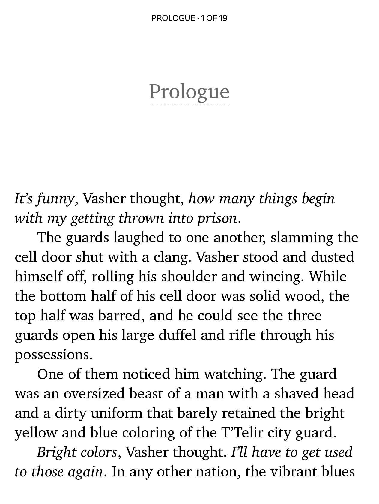
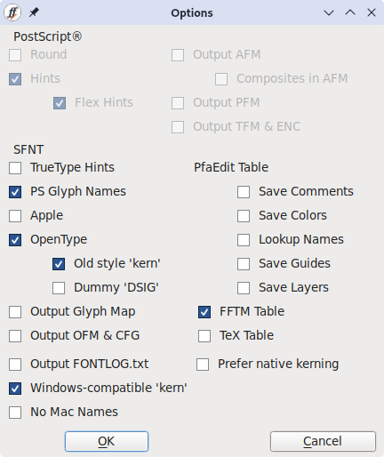

# Cartisse

This repository contains **Cartisse**, a renamed version of [XCharter](https://www.ctan.org/tex-archive/fonts/xcharter/), which is an extension for [Bitstream Charter](https://en.wikipedia.org/wiki/Bitstream_Charter).

## What is this?

**Cartisse is specifically intended to be used with Kobo e-readers.** You can also use it for general word processing and the like, but if you need more glyph coverage or advanced typography features I recommend looking at alternatives like [Charis](https://software.sil.org/charis/download/). 

Take a look at a screenshot of it on my [Kobo Libra Color](https://be.kobobooks.com/nl/products/kobo-libra-colour?variant=40852311736406) here:

<kbd></kbd>

This version omits a few ligatures that consistently looked bad on e-ink displays and has adjusted metrics for improved line height. 

A more verbose [license](./LICENSE) is also included as part of the distributed font files.

## How was this made?

Manually, for the most part, with FontForge.

- A few ligatures that did not render well on certain e-readers were removed, namely: `ff`, `ffi`, `ffl`, `fl`, `fi`.
- Some minor tweaks to kern pairs were made to tighten up the look and feel of the font, and to address the removed ligatures.
- Improved line height metrics were set (updated ascent/descent metrics).
- The font was renamed and re-exported (see "Export settings" below).
- The copyright notice has been updated to reflect the new name.

### Kern pair changes

I've included a file called [kern.md](./doc/kern.md) in this repository. I've checked and improved kern pairs to ensure these particular sentences look fine; they include often tweaked kern pairs.

### Export settings

Make sure to check the following items when exporting as TTF:



In particular, **old style 'kern'** is important for compatibility with older devices, like the Kobo devices that I am targeting specifically.

### Source files

I've included the FontForge files in this repository, you can find them in the `/src` folder. 

You can download the TrueType version of these fonts via [Releases](https://github.com/nicoverbruggen/cartisse/releases), which are ready to be copied to your favorite e-reader. Alternatively, you can export the source files yourself.

## License

In 1992 Bitstream donated a version of Charter, along with its version of Courier, to the X Consortium under terms that allowed the font to be modified and redistributed.

This font is _not_ related to the proprietary version, Charter BT.

```
Copyright (c) 1989-1992, Bitstream Inc., Cambridge, MA.
Copyright (c) 2009, 2010, 2011, 2012 Andrey V. Panov 
Copyright (c) 2013-2024 Michael Sharpe
Copyright (c) 2025-2026 Nico Verbruggen

XCharter is an extension of Bitstream Charter, whose original license is reproduced below, as required under the terms of that license. The extension provides small caps, oldstyle figures and superior figures in all four styles, accompanied by LaTeX font support files.

Cartisse is based on XCharter, but contains some metrics modifications and removes certain ligatures.

---

You are hereby granted permission under all Bitstream propriety rights
to use, copy, modify, sublicense, sell, and redistribute the 4 Bitstream
Charter (r) Type 1 outline fonts and the 4 Courier Type 1 outline fonts
for any purpose and without restriction; provided, that this notice is
left intact on all copies of such fonts and that Bitstream's trademark
is acknowledged as shown below on all unmodified copies of the 4 Charter
Type 1 fonts.

BITSTREAM CHARTER is a registered trademark of Bitstream Inc.
```
